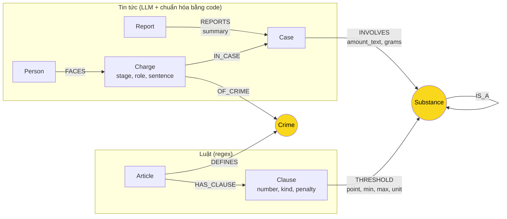

# Thiết kế Ontology — Day 19

**Họ tên:** Nguyễn Minh Hiếu  **MSSV:** 2A202602669

**Lựa chọn** (đánh dấu một):
- [ ] Dùng ontology gợi ý (có thể chỉnh nhỏ)
- [x] Tự thiết kế (xét bonus +15, xem `SUBMISSION.md`)

> Ontology này là mặc định của `src/graph.py`. Ontology gợi ý vẫn nằm trong code để làm baseline:
> `KG_ONTOLOGY=hint python bench_kg.py --judge --out ket_qua_benchmark_kg.hint.txt`.

## 1. Sơ đồ

Có hai node cầu nối: `Crime` (cầu chính, từ người sang Điều luật) và `Substance` (cầu phụ, từ khối lượng tang vật sang đúng khoản).

## 2. Entity types (node labels)

| Label | Ý nghĩa | Khóa định danh (`MERGE` theo) | Properties | Lấy từ KB nào | Trích bằng (regex / LLM / khác) |
| --- | --- | --- | --- | --- | --- |
| `Article` | Một Điều luật | `id` ("Điều 251 BLHS") | `title`, `law`, `doc_id` | Luật | Front matter + regex |
| `Clause` | Một khoản của Điều | `id` ("Điều 251 BLHS khoản 1") | `number`, `kind` (cơ bản / tăng nặng / cao nhất / bổ sung / khác / quy định), `penalty`, `header`, `text`, `doc_id` | Luật | Regex |
| `Crime` | Tội danh (cầu nối) | `name` đã chuẩn hóa | | Luật (tiêu đề Điều); tin chỉ được nối vào tên đã có | Regex; phía tin qua `link_entity` |
| `Substance` | Chất ma túy hoặc nhóm chất (cầu nối) | `name` chuẩn | `aliases` (tên lóng, tên khác) | Cả hai | Bảng tên chuẩn trong code; phía tin qua `canonical_substance` |
| `Report` | Một bài báo | `doc_id` | `name` (tiêu đề), `published` | Tin | Front matter |
| `Case` | Một vụ việc, dùng chung giữa nhiều bài | `id` = `doc_id#i` của bài đầu tiên nhắc tới vụ | `name`, `summary`, `date`, `location` | Tin | LLM; gộp vụ bằng code |
| `Person` | Người bị bắt, khởi tố, truy tố, xét xử | `key` = họ tên viết thường, bỏ khoảng trắng thừa | `name`, `aliases` | Tin | LLM; gộp người bằng code |
| `Charge` | Một lần một người bị xử lý về một tội ở một giai đoạn tố tụng | `id` = `case_id\|person_key\|crime\|stage` | `stage`, `role`, `sentence`, `doc_id` | Tin | LLM, `link_entity` cho `crime` và `stage` |

`Crime`, `Substance`, `Case`, `Person` không có `doc_id` vì chúng dùng chung giữa nhiều tài liệu. Mọi node sinh từ đúng một tài liệu (`Article`, `Clause`, `Report`, `Charge`) đều có `doc_id`.

## 3. Relationships

| Type | Từ → Đến | Properties trên cạnh | Ý nghĩa |
| --- | --- | --- | --- |
| `DEFINES` | `Article` → `Crime` | | Điều luật quy định tội danh |
| `HAS_CLAUSE` | `Article` → `Clause` | | Điều có khoản |
| `THRESHOLD` | `Clause` → `Substance` | `point` (điểm a, b…), `min`, `max` (rỗng nếu "trở lên"), `unit` (gam / mililít), `text` | Khoản áp dụng khi khối lượng chất nằm trong [`min`, `max`) |
| `IS_A` | `Substance` → `Substance` | | Chất không được BLHS nêu tên thuộc một nhóm chung (Ketamine → "chất ma túy khác ở thể rắn") |
| `REPORTS` | `Report` → `Case` | `summary` (bài này nói gì về vụ) | Bài báo đưa tin về vụ việc |
| `INVOLVES` | `Case` → `Substance` | `amount_text` (nguyên văn), `grams` (đã quy về gam, rỗng nếu không phải khối lượng) | Tang vật của vụ |
| `FACES` | `Person` → `Charge` | | Người chịu một cáo buộc |
| `IN_CASE` | `Charge` → `Case` | | Cáo buộc thuộc vụ nào |
| `OF_CRIME` | `Charge` → `Crime` | | Cáo buộc về tội gì |

## 4. Node cầu nối giữa 2 KB

- **Node nào:** `Crime` (chính) và `Substance` (phụ).
- **Vì sao chọn node này:** tội danh là thứ duy nhất được cả luật lẫn báo gọi bằng cùng một cụm từ pháp lý, nên từ một người trong tin đi được tới Điều luật. Riêng `Crime` chỉ đưa tới *Điều*; muốn tới đúng *khoản* thì phải so khối lượng tang vật với ngưỡng trong luật, và thứ nối hai con số đó là `Substance`.
- **Cách đảm bảo hai phía khớp tên:**
  - `Crime`: tên chuẩn lấy từ tiêu đề Điều qua `normalize_crime`. Danh sách tên chuẩn được đưa vào prompt, và kết quả của LLM vẫn đi qua `link_entity` (khớp chính xác trước, rồi `difflib` với ngưỡng 0,8). Không khớp thì `Charge` không có `OF_CRIME`, không tạo `Crime` mới.
  - `Substance`: bảng `SUBSTANCE_ALIASES` trong code gom tên lóng về tên chuẩn ("kẹo", "thuốc lắc" → MDMA). Phía luật dùng `LAW_SUBSTANCE_GROUPS` để tách mỗi điểm thành các chất chuẩn.
- **Khi nào cầu gãy, và xử lý thế nào:**
  - Bài báo không nêu tội danh pháp lý (chỉ viết "bị bắt vì ma túy"), hoặc nêu tội ngoài Chương XX: `Charge` vẫn được tạo nhưng không có `OF_CRIME`. Truy vấn E1 trong báo cáo đếm các trường hợp này.
  - Khối lượng không quy được ra gam ("5 viên", "nửa chỉ"): `grams` rỗng, không chọn được khoản. `context()` lùi về trả khung cơ bản và khung cao nhất của Điều.
  - Chất không có trong bảng tên chuẩn: giữ nguyên tên báo viết, không có `THRESHOLD`.

## 5. Competency questions

| Câu | Đường đi (Cypher pattern) | Trả lời được? |
| --- | --- | --- |
| Q1 | Không có đường đi riêng: định nghĩa "tiền chất" nằm trong `Clause.text` của Điều 2 Luật PCMT, graph không tách thuật ngữ thành node | Không bằng graph; dựa vào chunk vector. Chấp nhận vì là câu một bước trong một đoạn văn |
| Q2 | `(:Report)-[:REPORTS]->(:Case)<-[:IN_CASE]-(ch:Charge {sentence:'tử hình'})<-[:FACES]-(:Person)` | Có |
| Q3 | `(:Person {key:'lê minh thành'})-[:FACES]->(ch:Charge)-[:OF_CRIME]->(:Crime)<-[:DEFINES]-(:Article)-[:HAS_CLAUSE]->(:Clause {kind:'cơ bản'})`, mức án ở `ch.sentence` | Có |
| Q4 | `(:Person)` khớp `aliases` "Hoàng Nato" `-[:FACES]->(:Charge)-[:OF_CRIME]->(:Crime)<-[:DEFINES]-(:Article)-[:HAS_CLAUSE]->(:Clause {kind:'cao nhất'})` | Có |
| Q5 | Q3, cộng `(ch)-[:IN_CASE]->(k:Case)-[i:INVOLVES]->(s:Substance)<-[t:THRESHOLD]-(cl:Clause)<-[:HAS_CLAUSE]-(a)` với `t.min <= i.grams AND (t.max IS NULL OR i.grams < t.max)` | Có, khi báo nêu khối lượng |
| Q6 | `(:Substance {name:'MDMA'})<-[:INVOLVES]-(k:Case)<-[:REPORTS]-(:Report)` | Có, trong phạm vi LLM trích được chất của từng vụ |

## 6. Quyết định thiết kế và đánh đổi

1. **`Charge` là node, không phải property trên cạnh.** Phương án khác: giữ như gợi ý, tội danh gắn vào `Case` và mức án nằm trên cạnh `Person → Case`. Chọn node vì một vụ có nhiều người với tội khác nhau (vụ Hoàng Nato: người tổ chức sử dụng, người chỉ sử dụng), và một người có thể qua nhiều giai đoạn (sơ thẩm rồi phúc thẩm). Đánh đổi: thêm một bước nhảy trên mọi đường đi và JSON trích xuất dài hơn.
2. **Ngưỡng khối lượng là cạnh `THRESHOLD` có `min`/`max`, không phải node riêng.** Phương án khác: node `Threshold` giữa `Clause` và `Substance`. Chọn cạnh vì mỗi ngưỡng chỉ nối đúng một khoản với một chất, không có gì khác trỏ vào nó. Đánh đổi: điểm "có 02 chất ma túy trở lên" (cộng dồn nhiều chất) không biểu diễn được.
3. **`Case` khóa bằng `doc_id#i` và gộp theo bị can chung, không khóa theo tên LLM đặt.** Phương án khác: `MERGE` theo `name` như gợi ý. Tên do LLM đặt mỗi bài một kiểu nên một vụ thành nhiều node. Đánh đổi: nếu một người dính hai vụ thật sự khác nhau thì bị gộp nhầm.
4. **`Location` chỉ là property của `Case`.** Phương án khác: node `Location` như gợi ý. Không câu hỏi nào đi qua địa điểm, và tên địa điểm do LLM viết không ổn định ("TP.HCM", "Thành phố Hồ Chí Minh") nên node sẽ trùng mà không ai dùng.
5. **Chỉ lưu người bị bắt, khởi tố, truy tố, xét xử.** Phương án khác: lưu cả cán bộ, luật sư như gợi ý. Bỏ để graph nhỏ hơn và `seed_facts` không kéo vụ án vào câu hỏi chỉ vì trùng tên một cán bộ. Đánh đổi: không trả lời được câu hỏi kiểu "ai chỉ đạo chuyên án".

## 7. So với ontology gợi ý (bắt buộc nếu xét bonus)

Hai file kết quả chạy cùng model (`gemini:gemini-3.1-flash-lite`), cùng `top_k=3`, `chunk_size=800`, 176 chunk:
`ket_qua_benchmark_kg.hint.txt` (ontology gợi ý, 203 node / 391 cạnh) và `ket_qua_benchmark_kg.txt` (ontology này, 253 node / 548 cạnh).

| Chỉ số GraphRAG | Gợi ý | Tự thiết kế |
| --- | --- | --- |
| recall trung bình | 0.89 | 1.00 |
| judge trung bình | 1.83 | 2.00 |
| in_tok mỗi câu | 5621 | 2236 |
| Indexing in_tok / out_tok | 34619 / 6059 | 39199 / 7188 |

| Điểm khác | Gợi ý làm gì | Bạn làm gì | Vấn đề nó giải quyết | Bằng chứng (Cypher, hoặc số liệu benchmark) |
| --- | --- | --- | --- | --- |
| Khung hình phạt | `context()` chỉ lấy khoản 1 và khoản nhắc tới chất của vụ | `Clause.kind`; luôn lấy khoản `cơ bản` và `cao nhất` của Điều | Câu hỏi về mức phạt tối đa của tội không có ngưỡng chất (Điều 255) | Q4 gợi ý: recall 0.67, judge 1, trả lời "mức phạt tù tối đa … là **07 năm**". Q4 tự thiết kế: recall 1.00, judge 2, "khung hình phạt cao nhất (khoản 4) là phạt tù 20 năm hoặc tù chung thân" |
| Ngưỡng khối lượng | `Clause -[:MENTIONS]-> Substance`, không có số | `THRESHOLD {min, max, unit}` + `INVOLVES.grams`; Cypher chọn khoản | Gợi ý đưa nguyên văn cả 4 khoản để LLM tự so; tốn token và phụ thuộc LLM | Vụ Cái Quang Huy, gợi ý trả 4 khoản Điều 250 (1328 + 1220 + 1014 + 928 ký tự). Tự thiết kế trả đúng 1 dòng: `{article: 'Điều 250 BLHS', clause: 4, point: 'b', substance: 'MDMA', grams: 9600.0}`. in_tok mỗi câu giảm từ 5621 xuống 2236 |
| Trùng vụ việc | `MERGE (:Case {name})` theo tên LLM đặt | `Case.id` xác định, gộp theo bị can chung; `Report` giữ nguồn | Một vụ được nhiều bài đưa tin thành nhiều node | Gợi ý: `MATCH (p:Person {name:'Dương Minh Tuấn'})-[:INVOLVED_IN]->(k:Case) RETURN k.name` ra **4** vụ; Cái Quang Huy ra **2** vụ. Tự thiết kế: `MATCH (r:Report)-[:REPORTS]->(k:Case) RETURN k.name, count(r)` ra 1 vụ "Dương Minh Tuấn (Hoàng Nato)" với 4 bài, 1 vụ Cái Quang Huy với 2 bài. Tổng `Case`: 17 xuống 12 |
| Tội danh theo người | `Case -[:CHARGED_WITH]-> Crime` | `Person -[:FACES]-> Charge -[:OF_CRIME]-> Crime` | Mọi người trong vụ bị gán mọi tội của vụ | Gợi ý: 3 trong 4 vụ của Dương Minh Tuấn có `CHARGED_WITH` tới cả "tàng trữ", "mua bán", "tổ chức sử dụng". Tự thiết kế: `Charge` của ông chỉ nối `OF_CRIME` tới "tổ chức sử dụng trái phép chất ma túy" |
| Giai đoạn tố tụng | Không có | `Charge.stage` | Phân biệt án đã tuyên với cáo buộc đang điều tra | `MATCH (ch:Charge) RETURN ch.stage, count(*)`: sơ thẩm 19, bắt giữ 11, khởi tố 5, truy tố 3, phúc thẩm 3 |
| Tên chất | Tên thô do LLM viết; có node `ma túy` | Bảng tên chuẩn + `aliases`; chất không rõ loại về một node riêng | Node `ma túy` khớp mọi câu hỏi có chữ "ma túy" trong `seed_facts`; tên lóng không gộp | Gợi ý: `MATCH (s:Substance) RETURN s.name` có `ma túy` (1 vụ). Tự thiết kế: bài viết "thuốc lắc" được nối vào `MDMA`, nên `MATCH (:Case)-[:INVOLVES]->(:Substance {name:'MDMA'})` có thêm vụ Hoàng Nato |

**Competency questions mà ontology gợi ý trả lời sai hoặc thiếu:**

- **Q4** (mức phạt tối đa của hành vi tổ chức sử dụng): gợi ý trả lời sai "07 năm"; ontology này trả lời đúng "20 năm hoặc tù chung thân".
- **Q6** (các vụ liên quan MDMA): gợi ý recall 0.67, thiếu "Lê Minh Thành" vì vụ được đặt tên "Vụ góp tiền mua ma túy tại Hà Nội" và tên người chỉ nằm trên cạnh; ontology này recall 1.00 vì `context()` liệt kê từng `Charge` kèm tên người.

Chi phí của thay đổi: indexing tốn thêm khoảng 13% token vào và 19% token ra, vì JSON trích xuất có thêm `stage` và danh sách `charges` cho từng người.

## 8. Hạn chế còn lại

- Gộp `Case` theo bị can chung có thể gộp nhầm hai vụ khác nhau của cùng một người; gộp `Person` theo họ tên có thể gộp hai người trùng tên.
- Không biểu diễn điểm "có 02 chất ma túy trở lên" và quy tắc quy đổi tiền chất ở Điều 253 khoản 5.
- Ngưỡng theo thể tích (mililít) được lưu nhưng chưa dùng, vì `INVOLVES` chỉ quy đổi khối lượng.
- Chỉ Ketamine được xếp vào nhóm "chất ma túy khác ở thể rắn". Chất lạ khác ("pod chill", "nước vui") không có ngưỡng.
- "thuốc phiện" trong tin được coi là nhựa thuốc phiện; "cần sa" được coi là lá, hoa, quả cây cần sa. Đây là giả định, báo thường không nói rõ dạng.
- Thuật ngữ của Luật PCMT (Điều 2) không được tách thành node, nên câu hỏi định nghĩa vẫn phụ thuộc vector search.
